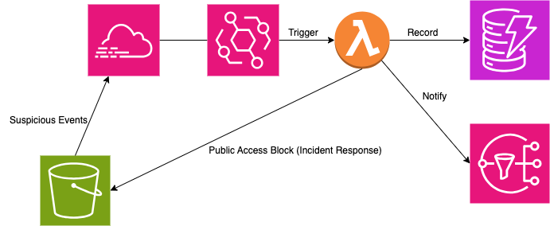

# Cloud-Security-Capstone

## What does this project do?
This project is an AWS-native, event-driven incident-response workflow that prevents accidental S3 exposure. CloudTrail events (e.g., PutBucketAcl, PutBucketPolicy, Delete|PutPublicAccessBlock) are matched by EventBridge to invoke a Lambda function that detects risky “public access” changes, then auto-remediates by enforcing S3 Block Public Access (PAB) with an optional dry-run mode. The function records a structured audit trail (DynamoDB, optional S3 evidence) and sends notifications via SNS/Email, with logs/metrics in CloudWatch. An optional daily scheduled scan provides a backup safety net. Deployed via SAM/CloudFormation with minimal IAM, the solution is cost-aware and aligns with AWS Well-Architected best practices.

## Architecture

## Setup
1. Lambda Function: Upload the `lambda_handler.py` to create the funciton
2. In AWS EventBridge, create the corresponding rule using `event_pattern.json`
3. Create CloudTrail to capture events
4. Setup SNS topic and email subscription (After setup, also put the variable into the lambda environment)
5. Once set up, run `create_bucket.sh` to trigger the whole pipeline, can expect receiving email and blocking the public access

## Deployment
```./deploy.sh```
